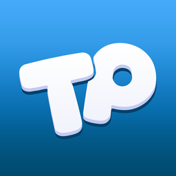
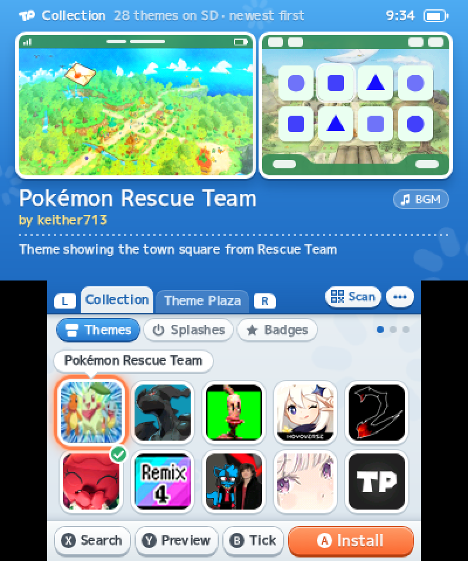
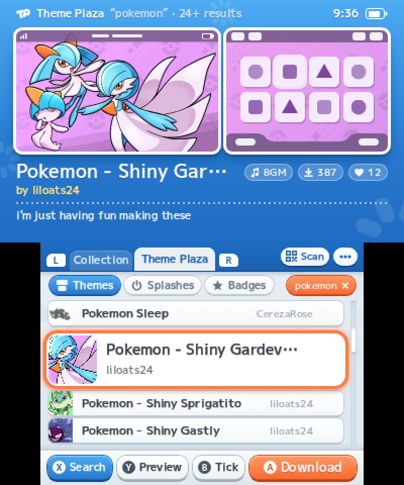

<p align="center">
  
</p>

<h1 align="center">Theme Plaza</h1>

<p align="center">Themes, splash screens and badges for your 3DS, straight from <a href="https://themeplaza.art">themeplaza.art</a>.</p>

<p align="center">
  <a href="https://github.com/KennLDN/themeplaza-app/releases/latest"></a>
  <a href="https://github.com/KennLDN/themeplaza-app/releases"></a>
  <a href="https://github.com/KennLDN/themeplaza-app/actions/workflows/build.yml"></a>
  <a href="LICENSE"></a>
</p>

<p align="center">
  
  &nbsp;&nbsp;
  
</p>

Theme Plaza is a homebrew app for the Nintendo 3DS. It shows what's on your SD card and what's on
the site, side by side, in the same two-screen layout: preview on top with the theme's own music,
list below. Pick a theme and install it, tick a few and install them as a shuffle, scan a QR code
from the site, download straight to the SD card. Splashes and badges work the same way, including
the badge box on the HOME Menu.

It has its own HOME Menu icon, start-up animation and 3D banner, and three music loops to browse
to, all generated by the scripts in this repository.

## Using it

Grab the `.cia` from the [releases page](https://github.com/KennLDN/themeplaza-app/releases) and
install it with FBI (or any CIA installer) on a console running custom firmware. There's a `.3dsx`
for the Homebrew Launcher next to it. The app keeps
its own files in `/3ds/Theme Plaza/` on the SD card and reads themes from `/Themes`, splashes from
`/Splashes` and badges from `/Badges`, the same folders as before.

## Building

The build runs in the devkitPro container, so the only things to install are podman and Python 3.
`makerom` and `bannertool` are included under `tools/bin/`.

```
cd app
./build.sh            # development build, with the test channel the emulator scripts use
./build.sh release    # the one to install
```

## How it's put together

- `app/` is the app itself: C++ on libctru and citro3d, with its own 2D renderer, text layout,
  PNG and BCSTM decoders, a small HTTP client and the QR reader.
- `tools/` makes everything the app ships with. The icon is rendered from the SVG at 48 pixels.
  The start-up animation is written as a scene and packed into the HOME Menu's logo format. The
  banner is a real 3D scene: the mark is inflated from the icon's own outlines, and the file is
  produced by our own reader and writer for the HOME Menu's scene format (`tools/cgfx.py`). The
  music is composed as notes and rendered with sampled instruments.
- `emulator/` drives the Azahar emulator for end-to-end tests: it installs a build, boots a dumped
  HOME Menu, works the app through a test channel, and checks what ended up on the SD card and in
  the HOME Menu's data.
- `docs/` has what we learned about the theme, splash, badge and banner formats along the way.

## Regenerating the assets

| Asset | Command | Needs |
|---|---|---|
| Icon | `python3 tools/make_icon.py` | Chromium |
| Start-up animation | `python3 tools/make_logo.py install` | Chromium, Pillow, numpy, and the HOME Menu's logo key in `~/.3ds/` (`tools/find_logo_key.py` reads it out of your own HOME Menu dump) |
| Banner | `python3 tools/make_banner.py install` | Pillow, numpy, scipy, shapely |
| Music and banner sound | `tools/.venv/bin/python tools/make_music.py install` | a virtualenv with numpy, scipy and tinysoundfont, plus the FluidR3 GM SoundFont at `/usr/share/soundfonts/FluidR3_GM.sf2` |

Each script is deterministic: run it and you get the committed file back, byte for byte.

## Tests

```
python3 tools/check_all.py --quick    # PC side: file readers, PNG decoder, caches, QR, BCSTM, sanitizers
python3 tools/check_all.py            # the same, then the end-to-end run in the emulator
```

The emulator run needs Azahar with the HOME Menu of a 3DS you own, and the test content that
`emulator/seed_sd.py` fetches from the site.

## Licence

MIT. Bundled with it: quirc (ISC), the M PLUS 1p font (SIL Open Font License), makerom and
bannertool (MIT). The music was rendered with the FluidR3 GM SoundFont (MIT), which isn't included.
